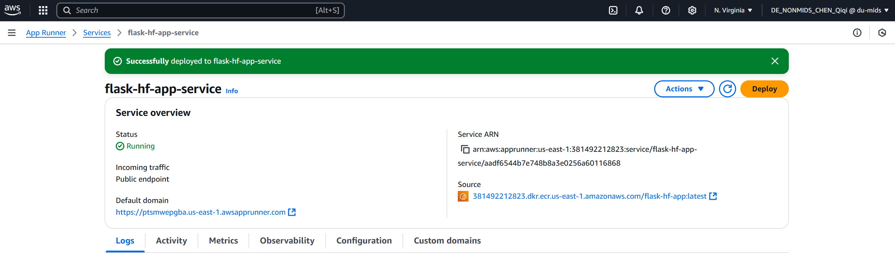
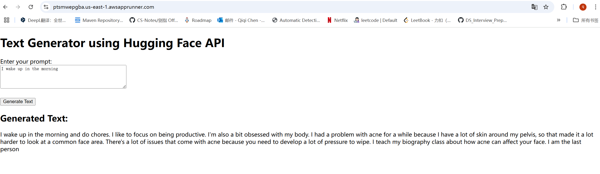
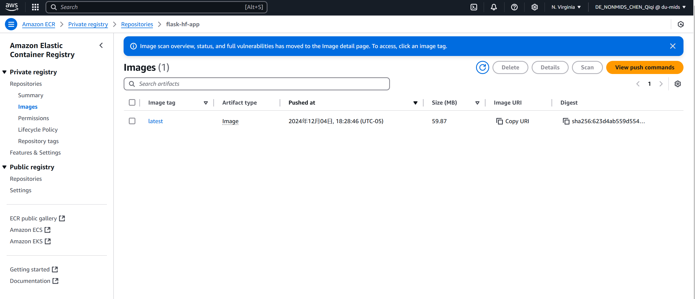

# Flask Hugging Face Text Generation App

A Flask web application that integrates Hugging Face's text generation API to generate text based on user input prompts. The application is containerized using Docker, pushed to Amazon ECR (Elastic Container Registry), and deployed on AWS App Runner, providing a publicly accessible, auto-scaling web service.
## Demo Video
https://youtu.be/4OP7gOE30kQ

## Features

- **Text Generation**: Users can input a prompt, and the application will generate text using Hugging Face's GPT-2 model.
- **Embedded LLM**: The application embeds a language model within Flask via the Hugging Face API.
- **Containerization**: The app is containerized using Docker and pushed to Amazon ECR.
- **Auto-Scaling Web App**: Deployed on AWS App Runner, which provides automatic scaling based on traffic.

---

## Prerequisites

- **Python 3.7 or higher**
- **Docker**
- **AWS CLI**
- **AWS Account** with permissions to use ECR and App Runner
- **Hugging Face API Key**

---

## Installation

### 1. Clone the Repository

```bash
git clone https://github.com/your_username/flask-hf-app.git
cd flask-hf-app
```

### 2. Set Up a Virtual Environment

```bash
python -m venv venv
```

### 3. Activate the Virtual Environment

- On Windows:

  ```bash
  venv\Scripts\activate
  ```

- On macOS/Linux:

  ```bash
  source venv/bin/activate
  ```

### 4. Install Dependencies

```bash
pip install -r requirements.txt
```

### 5. Set Up Environment Variables

Create a `.env` file in the project root:

```
HF_API_KEY=your_hugging_face_api_key
```

**Note:** Do not commit the `.env` file to version control.

---

## Running the Application Locally

```bash
python app.py
```

Access the application at `http://localhost:5000`.

---

## Dockerization

### 1. Build the Docker Image

```bash
docker build -t your_dockerhub_username/flask-hf-app .
```

### 2. Run the Docker Container Locally

```bash
docker run -p 5000:5000 -e HF_API_KEY=your_hugging_face_api_key your_dockerhub_username/flask-hf-app
```

Access the application at `http://localhost:5000`.

### 3. Push the Docker Image to Amazon ECR

#### a. Authenticate Docker to ECR

```bash
aws ecr get-login-password --region your-region | docker login --username AWS --password-stdin your_account_id.dkr.ecr.your-region.amazonaws.com
```

#### b. Create an ECR Repository

```bash
aws ecr create-repository --repository-name flask-hf-app --region your-region
```

#### c. Tag the Docker Image

```bash
docker tag your_dockerhub_username/flask-hf-app:latest your_account_id.dkr.ecr.your-region.amazonaws.com/flask-hf-app:latest
```

#### d. Push the Image to ECR

```bash
docker push your_account_id.dkr.ecr.your-region.amazonaws.com/flask-hf-app:latest
```

---

## Deploying to AWS App Runner

### 1. Create an App Runner Service

- Navigate to the AWS App Runner console.
- Click **"Create an App Runner service"**.

### 2. Configure the Service

- **Source**: Choose **"Container Registry"**.
- **Provider**: Select **"Amazon ECR"**.
- **Repository**: Select your ECR repository `flask-hf-app`.
- **Image Tag**: Choose `latest`.

### 3. Set Environment Variables

- Add `HF_API_KEY` and set it to your Hugging Face API key.
- Add `PORT` and set it to `5080`.

### 4. Service Settings

- **Service Name**: Enter `flask-hf-app-service`.
- **CPU and Memory**: Choose appropriate settings (e.g., 1 vCPU, 2 GB Memory).

### 5. Deploy

- Review the settings and click **"Create & Deploy"**.
- Wait for the deployment to complete.

### 6. Access the Application

- Once deployed, App Runner provides a default domain.
- Access your application via the provided URL.

You could access my Text Generator using Hugging Face API
https://ptsmwepgba.us-east-1.awsapprunner.com/

---

##  Auto-Scaling

AWS App Runner is designed to deploy containerized web applications quickly and easily, and it provides automatic scaling out of the box. This means my application will automatically scale up to handle increased traffic and scale down when the traffic decreases, without any manual intervention.

## Additional Information

### Using the Hugging Face API

- The application uses the GPT-2 model from Hugging Face.
- It sends a POST request to the Hugging Face inference API with the user's prompt.
- The generated text is displayed back to the user.

### Creativity and Sophistication

- **Embedded LLM**: The app integrates an embedded language model using Hugging Face's API.
- **User Interface**: Enhanced with Bootstrap for a better user experience.
- **Error Handling**: Implements robust error handling for API requests.
### Quality of Conclusion and Recommendation
This project effectively demonstrates the integration of a Flask application with an embedded LLM, containerized using Docker and deployed on AWS to achieve automatic scaling. The chosen approach ensures both reliability and cost-efficiency. For future enhancements, consider experimenting with more advanced LLM models for improved output quality, refining the user interface for better user experience, and integrating additional AWS services like Secrets Manager to further secure API keys and sensitive information.
## Screenshot
### AWS Web App

### Flask App

### Use of ECR



